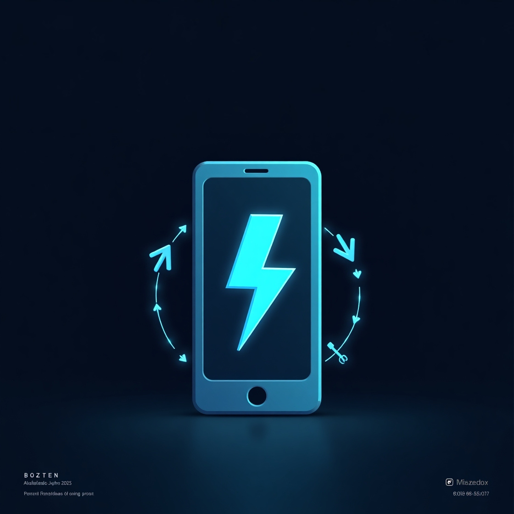

  
 
    

Projeto Ebook: Manutenção de smartphones (Gerado por IA)
-
Projeto realizado na DIO, para desenvolvimento de habilidades. 
Guia apresenta soft-skills para se iniciar a carreira como técnico de smartphones. 

Acesse o ebook [Manutenção Sem Enrolação](https://github.com/Boenteprog/smartphone-repair-guide-ai-by-me-edited/blob/main/fold-ebook/bz-ebook.pdf)

Técnologias que utilizei: 
-
[ChatGPT](https://chatgpt.com/?model=auto) 
 [Canvas](https://www.canva.com/)
 [Leonardo.AI](https://leonardo.ai/)
 [Power Point Online](https://powerpoint.cloud.microsoft/pt-br/) 

Prompts utilizados: 
-

ChatGPT:

| Ação               | Prompt                                                                                                             |
|--------------------|---------------------------------------------------------------------------------------------------------------------|
| **Título**         | Crie um título de um ebook sobre o tema de manutenção de smartphones, o ebook é do nicho de manutenção de eletrônicos, e o sub-nicho é de smartphones. O título deve ser atrativo e curto, com uma temática mais atrativa a quem buscar renda extra, mas não consegue encontrar conteúdos genuínos web. Me liste 5 variações de títulos. |
| **Conteúdo Gerado** | 📱 **Manutenção Sem Enrolação – E-book Técnico** – Curso introdutório da Assistência Técnica Bozten.  Guia prático e direto para começar na manutenção de smartphones, com foco em hardware, software e técnicas simples.  **Conteúdo:** Introdução à eletrônica aplicada a smartphones; Componentes principais de placas; Tipos de bateria e tela; Diferença entre hardware e software; Casos práticos: troca de tela, bateria, limpeza, abertura; Conceitos de software: firmware, SO, apps; Exercícios e vídeos práticos por capítulo.  (Otimizado e reduzido no ChatGPT. Originalmente estava muito extenso) |

Leornardo AI:

| Ação               | Prompt                                                                                                             |
|--------------------|---------------------------------------------------------------------------------------------------------------------|
| **Gerador da Imagem** | Create a clean and modern image featuring a smartphone with a bold blue thunderbolt icon on its screen, symbolizing power and speed. The phone is centered inside a circle with rotating arrows around it, representing sustainability and continuous repair. Add a subtle tool icon (like a wrench or screwdriver) beside the phone, symbolizing a technical course. Overlapping the image or placed prominently across the front, include the bold, capitalized title: "MANUTENÇÃO SEM ENROLAÇÃO" in a clear, modern font. Use a blue and black color palette with tech-style energy, minimal distractions, and professional layout. The background can include soft tech elements or a subtle digital texture. (Feita no Leonardo.AI — o resultado veio com erros de português e foi ajustado no Canva) |

Considerações finais 
-
Este é meu segundo ebook gerado por IA, a experiencia é única entre praticidades e usuabilidade que ela nos gera. Tentei ser detalhista com os prompts mas ainda tive um pouco de dificuldade na geração das imagens. Este ebook aborda sobre minha area atual profissional, e não tive muita dificuldade na geração do conteúdo. Optei por detalha-lo mais um pouco, mesmo que enxuto, contando com premissas-chave para inicio na área. 

Creditos ao [Felipe Aguiar](https://github.com/felipeAguiarC ode/prompts-recipe-to-create-a-ebook/blob/main/README.MD) que palestrou a aula.

-
[Meu insta](https://www.instagram.com/bozten.tec/) 
 [Insta da Bozten Tech](https://www.instagram.com/gluizboente/)

